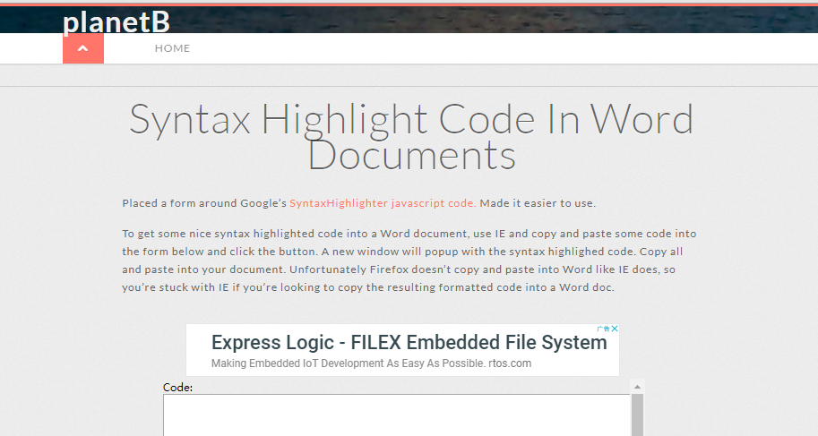
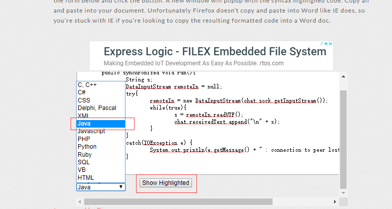
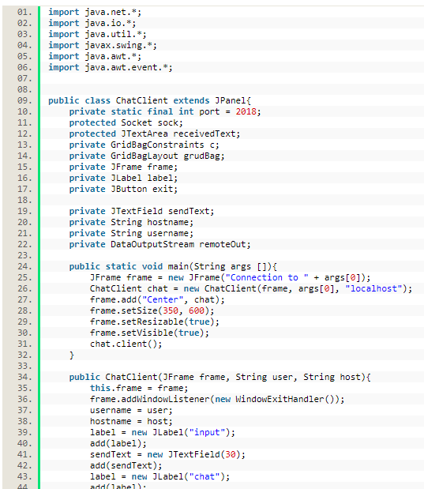
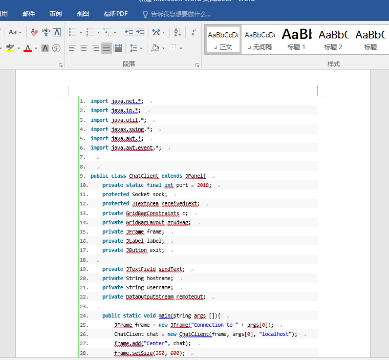

## 如何使粘贴到word中的代码仍然保持原格式和语法高亮
 
>来源：<https://blog.csdn.net/qq_40395278/article/details/81045952>
 
 
 
#### 步骤1：进入这个网页<http://www.planetb.ca/syntax-highlight-word>
 
 
 
#### 步骤2：将需要粘贴到word中的代码粘贴到网站下面的文本框内,并选择语言后点击Show Hightlighted,生成第二张图的代码
 
 
 
 
#### 步骤3：ctrl-a，ctrl-c复制网页中的代码，粘贴到需要粘贴的word中，下图是效果
