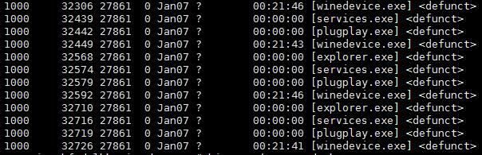
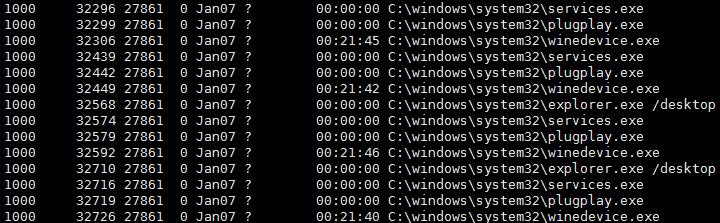
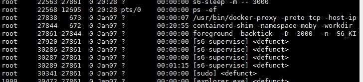

#  linux服务器以为被黑了的经历

去年在阿里云白嫖了半年服务器，在2020年年底到期，到期前参加了一个考试又免费续了半年，但是突然服务器连不上去了。

ssh连接很慢，很卡，官网直接超时，xshell可以连接但延迟很严重。

我打开top看了一下，发现有很多.exe结尾的进程。

然后用ps -ef看了一下

用killall winedevice.exe之后发现突然不卡了，看来这就是问题所在了，不过过一会儿这些程序还会自动运行。

然后第一反应会不会服务器被黑了，开始查用户

cat /etc/passwd
grep :0: /etc/passwd
输出只有root，找不到其它用户，但是有ps中有uid为1000的用户。

后来仔细看ps -ef中的PPID字段发现有相同的id，看来都是由它引起的，发现是个s6-***，百度查了一下发现是docker。

于是试了一下关闭docker
docker serveice stop docker 没有效果
/etc/init.d/docker stop 成功

原来只是docker太卡了

